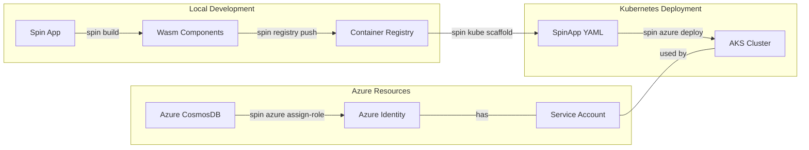

# Spin Azure Plugin

A CLI tool for deploying and managing [Spin](https://github.com/fermyon/spin) applications on Azure Kubernetes Service (AKS) with workload identity.

## Install 

```sh
spin plugins update
spin plugins install azure
```

## Install from source

Manual installation is commonly used to test in-flight changes. For a user, it's better to install the plugin using Spin's plugin manager.

Ensure the `pluginify` plugin is installed:

```sh
spin plugins update
spin plugins install pluginify --yes
```

Fetch the plugin:

```sh
git clone git@github.com:mossaka/spin-plugin-azure.git
cd spin-plugin-azure
```

Compile and install the plugin:

```sh
make
make install
```

## Prerequisites

- [Azure CLI](https://docs.microsoft.com/en-us/cli/azure/install-azure-cli) (`az` command version 2.70.0 or higher)
- [kubectl](https://kubernetes.io/docs/tasks/tools/)
- [Spin CLI](https://github.com/fermyon/spin)
- [Helm](https://helm.sh/docs/intro/install/) - package manager for Kubernetes
- An Azure subscription

## Usage

### Login to Azure

```bash
spin azure login
```

### Create a new AKS cluster

```bash
spin azure cluster create --name my-cluster --resource-group my-rg --location eastus
```

This creates a complete environment in one command:
- AKS cluster with workload identity enabled
- Spin Operator installed

You can specify any additional `az aks create` arguments, which will be passed directly to the underlying Azure CLI:

```bash
spin azure cluster create --name my-cluster --resource-group my-rg -- --kubernetes-version 1.24.9 --node-count 3 --node-vm-size Standard_D4s_v3 --zones 1 2 3
```

See `az aks create --help` for the full list of supported arguments.

### Use an existing AKS cluster

```bash
spin azure cluster use --name existing-cluster --resource-group existing-rg
```

When using an existing cluster, you can optionally install the Spin Operator:

```bash
spin azure cluster use --name existing-cluster --resource-group existing-rg --install-spin-operator
```

### Create a new identity

```bash
spin azure identity create # will create a new identity called "workload-identity"
spin azure identity create --name my-custom-identity # will create a new identity called "my-custom-identity"
```

### Check workload identity status

```bash
spin azure cluster check-identity
```

This checks if workload identity is **enabled** on the current cluster, and enables it if not. This command does not create an Azure managed identity or service account. Please use `spin azure identity create` to create an identity.

### Install Spin Operator

You can install the Spin Operator on an existing cluster:

```bash
spin azure cluster install-spin-operator
```

Note: the `spin azure cluster create` command also installs the Spin Operator by default.

### Assign Role to Azure CosmosDB

```bash
spin azure assign-role cosmosdb --name my-cosmos --resource-group my-rg # will assign the role to the identity called "workload-identity"
```

Or specify an existing identity:

```bash
spin azure assign-role cosmosdb --name my-cosmos --resource-group my-rg --identity my-custom-identity
```

This assigns the necessary RBAC roles to your workload identity, allowing it to access the specified CosmosDB instance.

### Deploy a Spin application

You can deploy a Spin application to your cluster with a simple command:

```bash
spin azure deploy --from path/to/spinapp.yaml
```

> warning: since SpinApp CRD does not support serviceAccountName yet, you need to edit the deployment YAML file to set the `serviceAccountName` field to `workload-identity`.

## Workflow Explanation:


1. **`spin registry push`**:
   - build the Spin application locally and push it to a container registry (e.g. Azure Container Registry)


1. **`spin kube scaffold`**:
   - Use `spin kube scaffold --from <image>` to generate a SpinApp Custom Resource Definition (CRD) YAML file
   - This YAML specifies how to deploy your Spin app in Kubernetes using the Spin Operator

1. **`spin azure cluster create / use`**:
   - Create a new AKS cluster with workload identity enabled
   - Install the Spin Operator

1. **`spin azure identity create`**:

1. **`spin azure assign-role`**:
   - Assign necessary Azure service roles to the workload identity

1. **`spin azure deploy`**:
   - Use `spin azure deploy --from <path to yaml>` to deploy this YAML to your AKS cluster

## Mermaid Diagram



